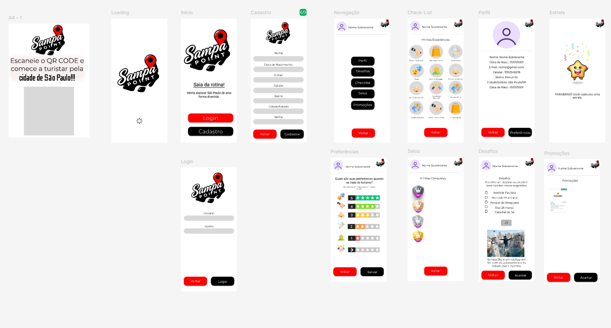

# Visite SP

## Descrição do Projeto

Este projeto foi desenvolvido durante o Hackathon Visite SP, com o objetivo de incentivar os moradores a explorar mais a própria cidade.

## Solução Proposta

- **Gameficação**: Transformar o ato de visitar lugares em uma experiência divertida e envolvente.
- **QR Codes**: Distribuição de diversos QR Codes em pontos estratégicos da cidade, como estações de metrô, parques e eventos (shows, teatros), permitindo que o usuário escaneie e adquira "selos".
- **Emblemas**: Os selos coletados se transformam em emblemas que podem ser trocados por descontos em estabelecimentos parceiros.
- **Notificações Futuras**: O sistema irá gerar notificações com sugestões de lugares para visitar e atividades a realizar, além de utilizar informações de outras aplicações existentes para sugerir roteiros e redirecionar o usuário para essas plataformas para mais informações.

## Imagens da Aplicação

## Criadores

- [Adriana Santos](https://www.linkedin.com/in/adrianasantos86/)
- [Luis Henrique das Neves Ribeiro](https://www.linkedin.com/in/luis-henrique-das-neves-ribeiro/)
- [Henrique Botella](https://www.linkedin.com/in/henriquebotella/)
- [Rafael Fabiano](https://www.linkedin.com/in/rafaelfabiano-/)

## Como Contribuir

Sinta-se à vontade para contribuir com o projeto! Sua ajuda é sempre bem-vinda. Para mais informações sobre como contribuir, entre em contato

## Licença

Este projeto está licenciado sob a [Licença MIT](LICENSE).

---

Agradecemos a sua visita! Explore e aproveite tudo que São Paulo tem a oferecer!
